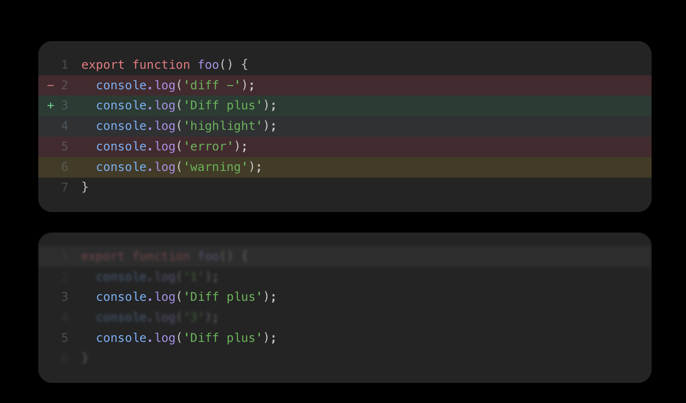

# Fork from [@rspress/plugin-shiki](https://rspress.dev/plugin/official-plugins/shiki)

> Shiki plugin for rspress

[Documentation](https://rspress.dev/plugin/official-plugins/shiki)

## Install

```bash
npm install rspress-plugin-shiki -D
```


```ts
import * as path from 'path';
import { defineConfig } from 'rspress/config';
import { pluginShiki, createTransformerDiff, createTransformerErrorLevel, createTransformerFocus, createTransformerHighlight, createTransformerLineNumber } from 'rspress-plugin-shiki';

export default defineConfig({
  root: path.join(__dirname, 'docs'),
  title: 'Rspress',
  description: 'Rspack-based Static Site Generator',
  icon: '/rspress-icon.png',
  logo: {
    light: '/rspress-light-logo.png',
    dark: '/rspress-dark-logo.png',
  },
  themeConfig: {
    socialLinks: [
      { icon: 'github', mode: 'link', content: 'https://github.com/web-infra-dev/rspress' },
    ],
  },
  plugins: [
    pluginShiki({
      transformers: [
        createTransformerDiff(),
        createTransformerErrorLevel(),
        createTransformerFocus(),
        createTransformerHighlight(),
        createTransformerLineNumber(),
      ]
    }),
  ]
});
```


